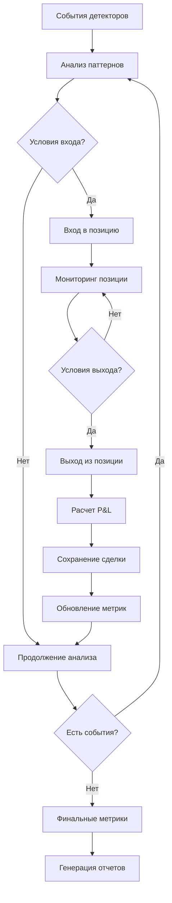

# Блок 14: Бэктест

## Обзор

Блок бэктестинга предназначен для тестирования торговых стратегий на исторических данных. Он реализует полный цикл торговли: вход в позицию, управление рисками, выход из позиции и расчет комплексных метрик производительности.

## Ключевые возможности

### 1. Торговая логика
- **Правила входа**: Анализ паттернов детекторов (D1-D8)
- **Управление позицией**: Динамическое изменение размера позиции
- **Правила выхода**: Stop Loss, Take Profit, выход по времени
- **Управление рисками**: Лимиты убытков, максимальная просадка

### 2. Анализ производительности
- **Базовые метрики**: Общий доход, количество сделок, процент выигрышных
- **Риск-метрики**: Коэффициент Шарпа, максимальная просадка, Sortino ratio
- **Торговые метрики**: Profit Factor, средняя сделка, средняя выигрышная/проигрышная
- **Временные метрики**: Средняя продолжительность сделки, распределение по времени

### 3. Отчетность
- **Детальные отчеты**: Сохранение в Parquet, CSV, JSON
- **Сводные отчеты**: Текстовые файлы с ключевыми показателями
- **Визуализация**: Графики производительности (опционально)
- **Анализ по детекторам**: Разбивка результатов по типам паттернов

## Архитектура

### Основные компоненты

```
BacktestEngine
├── __init__()                 # Инициализация с конфигурацией
├── run_backtest()             # Основной цикл бэктеста
├── _get_current_price()       # Получение текущей цены
├── _should_enter()            # Проверка условий входа
├── _should_exit()             # Проверка условий выхода
├── _enter_position()          # Вход в позицию
├── _exit_position()           # Выход из позиции
├── _force_close_position()    # Принудительное закрытие
└── calculate_metrics()        # Расчет метрик
```

### Поток обработки



## Использование

### Базовое использование

```python
from oflow.blocks.backtest import run_backtest
from pathlib import Path
import yaml

# Загрузка конфигурации
with open('configs/backtest.yaml', 'r') as f:
    config = yaml.safe_load(f)

# Запуск бэктеста
trades_df, metrics = run_backtest(
    events_df=detector_events,
    quotes_df=price_quotes,
    config=config,
    output_dir=Path("data/backtest")
)

# Анализ результатов
print(f"Всего сделок: {len(trades_df)}")
print(f"Общий доход: {metrics['total_return']:.4f}")
print(f"Процент выигрышных: {metrics['win_rate']*100:.1f}%")
```

### Продвинутое использование

```python
from oflow.blocks.backtest import BacktestEngine

# Создание движка с кастомной конфигурацией
custom_config = {
    'strategy': {
        'entry_rules': {'min_confidence': 0.8},
        'allowed_patterns': ['liquidity_vacuum_break']
    },
    'risk_management': {
        'stop_loss_pct': 1.5,
        'take_profit_pct': 3.0
    }
}

engine = BacktestEngine(custom_config)

# Запуск бэктеста
trades_df = engine.run_backtest(events_df, quotes_df)

# Расчет метрик
metrics = engine.calculate_metrics(trades_df)
```

## Конфигурация

### Основные параметры стратегии

```yaml
strategy:
  name: "Scalping Strategy"
  min_confidence: 0.7
  allowed_patterns:
    - "liquidity_vacuum_break"
    - "iceberg_fade"
  min_volume_ratio: 2.0
```

### Управление рисками

```yaml
risk_management:
  stop_loss_pct: 2.0        # Stop Loss в процентах
  take_profit_pct: 4.0      # Take Profit в процентах
  max_drawdown_pct: 10.0    # Максимальная просадка
  max_open_positions: 3     # Максимум открытых позиций
```

### Размер позиции

```yaml
position_sizing:
  max_size: 1.0             # Максимальный размер
  sizing_method: "fixed"    # Метод расчета
  dynamic_sizing: true      # Динамическое изменение
  high_confidence_multiplier: 1.5  # Множитель для высокоуверенных
```

### Настройки детекторов

```yaml
detectors:
  D1LiquidityVacuumBreak:
    entry_confidence: 0.8
    position_size: 1.0
    stop_loss: 1.5
    take_profit: 3.0
```

## Структура данных

### Входные данные

#### events_df (события детекторов)
```python
events_df.columns = [
    'ts_ns',              # Временная метка
    'exchange',           # Биржа
    'symbol',             # Символ
    'pattern_type',       # Тип паттерна
    'confidence',         # Уверенность (0.0-1.0)
    'volume_ratio',       # Соотношение объема
    'price_level',        # Ценовой уровень
    'detector_score'      # Оценка детектора
]
```

#### quotes_df (котировки)
```python
quotes_df.columns = [
    'ts_ns',              # Временная метка
    'exchange',           # Биржа
    'best_bid',           # Лучшая цена покупки
    'best_ask',           # Лучшая цена продажи
    'mid',                # Средняя цена
    'spread'              # Спред
]
```

### Выходные данные

#### trades_df (сделки)
```python
trades_df.columns = [
    'entry_time',         # Время входа
    'exit_time',          # Время выхода
    'entry_price',        # Цена входа
    'exit_price',         # Цена выхода
    'position_size',      # Размер позиции
    'pnl',                # Прибыль/убыток
    'pnl_pct',            # P&L в процентах
    'pattern_type',       # Тип паттерна
    'confidence',         # Уверенность
    'exchange',           # Биржа
    'duration_seconds'    # Продолжительность
]
```

#### metrics (метрики)
```python
metrics = {
    'total_return': 0.0,          # Общий доход
    'total_return_pct': 0.0,      # Общий доход в %
    'sharpe_ratio': 0.0,          # Коэффициент Шарпа
    'max_drawdown': 0.0,          # Максимальная просадка
    'win_rate': 0.0,              # Процент выигрышных
    'profit_factor': 0.0,         # Profit Factor
    'avg_trade': 0.0,             # Средняя сделка
    'avg_win': 0.0,               # Средняя выигрышная
    'avg_loss': 0.0,              # Средняя проигрышная
    'total_trades': 0,            # Всего сделок
    'winning_trades': 0,          # Выигрышных сделок
    'losing_trades': 0,           # Проигрышных сделок
    'avg_duration': 0.0           # Средняя продолжительность
}
```

## Алгоритмы

### 1. Логика входа в позицию

```python
def _should_enter(self, event, current_price):
    # Проверка уверенности
    if event['confidence'] < self.min_confidence:
        return False
    
    # Проверка типа паттерна
    if event['pattern_type'] not in self.allowed_patterns:
        return False
    
    # Проверка объема
    if event['volume_ratio'] < self.min_volume_ratio:
        return False
    
    return True
```

### 2. Логика выхода из позиции

```python
def _should_exit(self, event, current_price):
    # Расчет текущего P&L
    pnl_pct = self._calculate_current_pnl(current_price)
    
    # Stop Loss
    if pnl_pct <= -self.stop_loss:
        return True
    
    # Take Profit
    if pnl_pct >= self.take_profit:
        return True
    
    # Выход по времени
    if self._time_in_trade(event) > self.max_hold_time:
        return True
    
    return False
```

### 3. Расчет метрик

```python
def calculate_metrics(self, trades_df):
    # Базовые метрики
    total_return = trades_df['pnl'].sum()
    win_rate = len(winning_trades) / len(trades_df)
    
    # Коэффициент Шарпа
    returns = trades_df['pnl_pct'] / 100
    sharpe = returns.mean() / returns.std() * sqrt(252)
    
    # Максимальная просадка
    cumulative = trades_df['pnl'].cumsum()
    running_max = cumulative.expanding().max()
    drawdown = (cumulative - running_max) / running_max * 100
    max_drawdown = abs(drawdown.min())
    
    return metrics
```

## Метрики и показатели

### Метрики доходности

1. **Общий доход**: Сумма всех P&L сделок
2. **Общий доход (%)**: Процентная доходность
3. **Средняя сделка**: Среднее значение P&L
4. **Profit Factor**: Отношение валовой прибыли к валовым убыткам

### Риск-метрики

1. **Коэффициент Шарпа**: Отношение доходности к волатильности
2. **Максимальная просадка**: Максимальное падение от пика
3. **Sortino Ratio**: Модифицированный коэффициент Шарпа
4. **Calmar Ratio**: Отношение доходности к максимальной просадке

### Торговые метрики

1. **Процент выигрышных**: Доля прибыльных сделок
2. **Средняя выигрышная**: Средний P&L прибыльных сделок
3. **Средняя проигрышная**: Средний P&L убыточных сделок
4. **Соотношение выигрыш/проигрыш**: Отношение средних значений

### Временные метрики

1. **Средняя продолжительность**: Среднее время в позиции
2. **Распределение по времени**: Анализ эффективности в разные периоды
3. **Частота сделок**: Количество сделок в единицу времени

## Управление рисками

### Stop Loss и Take Profit

```yaml
risk_management:
  stop_loss_pct: 2.0      # Остановка убытков на 2%
  take_profit_pct: 4.0    # Фиксация прибыли на 4%
```

### Лимиты позиций

```yaml
risk_management:
  max_open_positions: 3           # Максимум 3 открытых позиции
  max_position_size_pct: 5.0      # Максимум 5% капитала на позицию
```

### Временные лимиты

```yaml
risk_management:
  max_hold_time: 300              # Максимум 5 минут в позиции
  daily_loss_limit_pct: 5.0       # Дневной лимит убытков 5%
  weekly_loss_limit_pct: 15.0     # Недельный лимит убытков 15%
```

## Отчетность

### Форматы экспорта

1. **Parquet**: Основной формат для дальнейшего анализа
2. **CSV**: Удобный для просмотра в Excel
3. **JSON**: Структурированные метрики
4. **TXT**: Человекочитаемые сводки

### Структура отчетов

```
data/backtest/
├── backtest_trades.parquet      # Детали сделок
├── backtest_trades.csv          # Сделки в CSV
├── backtest_metrics.json        # Метрики в JSON
├── backtest_summary.txt         # Сводный отчет
└── backtest_charts/             # Графики (опционально)
```

### Содержание сводного отчета

```
=== ОТЧЕТ БЭКТЕСТА ===

Дата: 2024-01-15 10:30:00
Всего сделок: 45
Выигрышных: 28
Проигрышных: 17
Процент выигрышных: 62.2%

=== МЕТРИКИ ===
Общий доход: 12.4500
Общий доход (%): 8.30%
Profit Factor: 1.85
Коэффициент Шарпа: 1.23
Максимальная просадка: 3.45%
Средняя сделка: 0.2767
Средняя выигрышная: 0.4450
Средняя проигрышная: -0.1830
Средняя продолжительность: 127.3с
```

## Интеграция с другими блоками

### Входные данные

- **Блок 12**: Детекторы - события паттернов для входа в позицию
- **Блок 05**: Лучшие цены - котировки для расчета P&L
- **Блок 10**: Фичи паттернов - дополнительные признаки для анализа

### Выходные данные

- **Блок 11**: Канонический слой - сохранение результатов бэктеста
- **Блок 15**: Экспорт разметки - выгрузка в TradingView/ATAS

## Примеры стратегий

### Стратегия 1: Scalping Strategy

```yaml
strategy:
  allowed_patterns: ["liquidity_vacuum_break"]
  min_confidence: 0.8
  position_size: 1.0
  
risk_management:
  stop_loss_pct: 1.5
  take_profit_pct: 3.0
```

### Стратегия 2: Multi-Pattern

```yaml
strategy:
  allowed_patterns:
    - "liquidity_vacuum_break"
    - "iceberg_fade"
    - "momentum_ignition"
  min_confidence: 0.7
  
risk_management:
  stop_loss_pct: 2.0
  take_profit_pct: 4.0
  max_open_positions: 2
```

### Стратегия 3: Conservative

```yaml
strategy:
  min_confidence: 0.9
  min_volume_ratio: 3.0
  
risk_management:
  stop_loss_pct: 1.0
  take_profit_pct: 2.0
  max_position_size_pct: 2.0
```

## Troubleshooting

### Типичные проблемы

1. **Нет сделок**: Проверить настройки входа, качество событий
2. **Все сделки убыточные**: Проверить Stop Loss, качество котировок
3. **Медленная работа**: Оптимизировать размер чанка, включить параллелизм
4. **Ошибки в метриках**: Проверить качество данных, валидацию

### Отладка

```python
# Включить детальное логирование
import logging
logging.basicConfig(level=logging.DEBUG)

# Проверить промежуточные результаты
engine = BacktestEngine(config)
trades_df = engine.run_backtest(events_df, quotes_df)
print(f"Найдено сделок: {len(trades_df)}")
```

## Будущие улучшения

1. **Машинное обучение**: Предсказание успешности сделок
2. **Оптимизация параметров**: Автоматический поиск лучших настроек
3. **Реальное время**: Интеграция с live trading
4. **Портфельный анализ**: Управление несколькими стратегиями
5. **Бэктест на GPU**: Ускорение вычислений
6. **Интеграция с брокерами**: Прямое исполнение сделок
