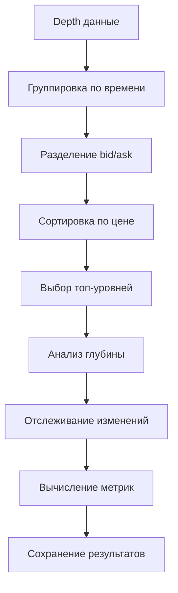

# Блок 06: Топ-зона книги

## Обзор

Блок анализа топ-зоны order book предназначен для детального изучения структуры ликвидности на верхних уровнях стакана заявок. Он анализирует топ-N уровней bid/ask, отслеживает изменения в реальном времени и вычисляет ключевые метрики ликвидности.

## Ключевые возможности

### 1. Анализ топ-уровней
- Группировка уровней по ценовым тикам
- Анализ глубины на каждом уровне
- Вычисление накопительной глубины
- Сопоставление bid/ask уровней

### 2. Отслеживание изменений
- Детекция добавления/удаления уровней
- Анализ изменений размера заявок
- Отслеживание обновлений уровней
- Классификация типов изменений

### 3. Метрики ликвидности
- Общая глубина стакана
- Дисбаланс bid/ask
- Концентрация ликвидности
- Оценка рыночного воздействия

### 4. Временная агрегация
- Агрегация по настраиваемым окнам
- Скользящие средние метрик
- Анализ трендов ликвидности
- Выявление паттернов изменений

## Архитектура

### Основные компоненты

```
BookTopAnalyzer
├── analyze_top_levels()     # Анализ топ-уровней
├── track_changes()          # Отслеживание изменений
├── calculate_book_metrics() # Вычисление метрик
└── save_book_top()          # Сохранение результатов
```

### Поток обработки



## Использование

### Базовое использование

```python
from oflow.blocks.book_top import run_book_top
from pathlib import Path
import yaml

# Загрузка конфигурации
with open('configs/book_top.yaml', 'r') as f:
    config = yaml.safe_load(f)

# Запуск анализа
results = run_book_top(
    depth_df=depth_data,
    config=config,
    output_dir=Path("data/book_top")
)

# Анализ результатов
book_levels = results['book_levels']
book_changes = results['book_changes']
book_metrics = results['book_metrics']
```

### Продвинутое использование

```python
from oflow.blocks.book_top import analyze_top_levels, track_changes

# Поэтапный анализ
book_df = analyze_top_levels(
    depth_df=depth_data,
    top_levels=15,
    tick_width=0.01
)

# Отслеживание изменений
changes_df = track_changes(
    book_df=book_df,
    depth_df=depth_data,
    min_depth_threshold=0.1
)

# Анализ метрик
metrics_df = calculate_book_metrics(book_df, changes_df)
```

## Конфигурация

### Основные параметры

```yaml
order_book:
  top_levels: 10              # Количество топ-уровней
  tick_width: 0.01            # Ширина ценового тика
  depth_threshold: 0.0        # Минимальный порог глубины
  time_window_ms: 10          # Временное окно агрегации
```

### Настройки анализа

```yaml
level_analysis:
  cumulative_depth: true       # Анализ накопительной глубины
  price_tick_analysis: true    # Анализ ценовых тиков
  min_active_size: 0.01       # Минимальный размер уровня
```

### Настройки метрик

```yaml
metrics:
  depth_metrics:
    - "total_depth"            # Общая глубина
    - "depth_imbalance"        # Дисбаланс bid/ask
    - "depth_concentration"    # Концентрация ликвидности
  
  liquidity_metrics:
    - "liquidity_score"        # Оценка ликвидности
    - "market_impact"          # Рыночное воздействие
```

## Структура данных

### Входные данные (depth_df)

```python
depth_df.columns = [
    'ts_ns',        # Временная метка (наносекунды)
    'exchange',     # Название биржи
    'symbol',       # Торговый символ
    'side',         # Сторона (bid/ask)
    'price',        # Цена уровня
    'size'          # Размер заявки
]
```

### Выходные данные

#### 1. book_levels (уровни order book)
```python
book_levels.columns = [
    'ts_ns',              # Временная метка
    'exchange',           # Биржа
    'side',               # Сторона (bid/ask)
    'level',              # Номер уровня (0 = best)
    'price',              # Цена уровня
    'size',               # Размер заявки
    'price_tick',         # Цена, округленная до тика
    'level_depth',        # Глубина на уровне
    'cumulative_depth'    # Накопительная глубина
]
```

#### 2. book_changes (изменения)
```python
book_changes.columns = [
    'ts_ns',              # Временная метка
    'exchange',           # Биржа
    'side',               # Сторона
    'level',              # Номер уровня
    'price',              # Цена
    'change_type',        # Тип изменения
    'size_change',        # Изменение размера
    'previous_size',      # Предыдущий размер
    'current_size'        # Текущий размер
]
```

#### 3. book_metrics (метрики)
```python
book_metrics.columns = [
    'ts_ns',              # Временная метка
    'exchange',           # Биржа
    'total_depth',        # Общая глубина
    'bid_depth',          # Глубина bid
    'ask_depth',          # Глубина ask
    'depth_imbalance',    # Дисбаланс bid/ask
    'liquidity_score',    # Оценка ликвидности
    'change_frequency'    # Частота изменений
]
```

## Алгоритмы

### 1. Анализ топ-уровней

```python
def analyze_top_levels(depth_df, top_levels, tick_width):
    # 1. Группировка по времени и биржам
    # 2. Разделение на bid/ask
    # 3. Сортировка по цене
    # 4. Выбор топ-уровней
    # 5. Вычисление метрик уровня
    # 6. Агрегация результатов
```

### 2. Отслеживание изменений

```python
def track_changes(book_df, depth_df, min_depth_threshold):
    # 1. Сопоставление уровней по времени
    # 2. Анализ изменений размера
    # 3. Классификация типов изменений
    # 4. Вычисление метрик изменений
    # 5. Фильтрация по порогам
```

### 3. Вычисление метрик

```python
def calculate_book_metrics(book_df, changes_df):
    # 1. Метрики глубины
    # 2. Метрики изменений
    # 3. Метрики ликвидности
    # 4. Временные агрегации
    # 5. Нормализация метрик
```

## Метрики и показатели

### Метрики глубины

1. **Общая глубина**: Сумма всех активных уровней
2. **Средняя глубина**: Среднее значение по уровням
3. **Дисбаланс bid/ask**: Отношение bid/ask глубины
4. **Концентрация**: Распределение ликвидности по уровням

### Метрики изменений

1. **Частота изменений**: Количество изменений в единицу времени
2. **Объем изменений**: Суммарный объем изменений
3. **Интенсивность**: Скорость изменений
4. **Паттерны**: Типичные последовательности изменений

### Метрики ликвидности

1. **Оценка ликвидности**: Комплексная оценка доступности ликвидности
2. **Рыночное воздействие**: Потенциальное влияние на цену
3. **Устойчивость**: Способность стакана восстанавливаться
4. **Эффективность**: Оптимальность структуры ликвидности

## Временная агрегация

### Окна агрегации

```yaml
aggregation:
  time_windows:
    - 1000    # 1 секунда
    - 5000    # 5 секунд
    - 10000   # 10 секунд
    - 60000   # 1 минута
```

### Методы агрегации

1. **Среднее значение**: Усреднение метрик по окну
2. **Медиана**: Центральное значение распределения
3. **Сумма**: Накопление значений
4. **Количество**: Подсчет событий
5. **Стандартное отклонение**: Мера волатильности

## Фильтрация и валидация

### Фильтры данных

```yaml
filtering:
  size_filter:
    min_size: 0.0
    max_size: 1000000.0
  
  price_filter:
    min_price: 0.0
    max_price: 100000.0
```

### Валидация качества

1. **Логичность bid/ask**: Проверка bid < ask
2. **Монотонность цен**: Проверка упорядоченности уровней
3. **Временные метки**: Проверка корректности времени
4. **Общее качество**: Комплексная оценка данных

## Производительность

### Оптимизации

1. **Чанковая обработка**: Разбиение на управляемые блоки
2. **Параллельная обработка**: Многопоточность для больших объемов
3. **Оптимизация памяти**: Эффективное использование ресурсов
4. **Кеширование**: Сохранение промежуточных результатов

### Рекомендации

```yaml
performance:
  chunk_size: 10000           # Размер чанка
  use_parallel: false         # Параллельная обработка
  max_workers: 4              # Количество воркеров
  optimize_memory: true       # Оптимизация памяти
```

## Интеграция с другими блоками

### Входные данные

Блок работает с нормализованными depth данными из Блока 02 (Импорт) и Блока 03 (Нормализация).

### Выходные данные

Результаты используются в:
- **Блок 07**: Лента сделок - для анализа агрессии
- **Блок 08**: Кросс-биржевая агрегация - для NBBO
- **Блок 10**: Фичи паттернов - для признаков детекторов
- **Блок 11**: Канонический слой - для сохранения

## Примеры использования

### Пример 1: Анализ топ-5 уровней

```python
config = {
    'order_book': {
        'top_levels': 5,
        'tick_width': 0.01
    }
}

results = run_book_top(depth_data, config)
```

### Пример 2: Детальный анализ изменений

```python
config = {
    'change_tracking': {
        'enabled': True,
        'min_change_threshold': 0.1
    },
    'metrics': {
        'change_metrics': ['frequency', 'volume', 'intensity']
    }
}
```

### Пример 3: Агрегация по минутам

```yaml
aggregation:
  time_windows: [60000]  # Только 1 минута
  methods: ["mean", "sum", "std"]
```

## Troubleshooting

### Типичные проблемы

1. **Пустые результаты**: Проверить входные данные и фильтры
2. **Медленная обработка**: Уменьшить размер чанка, включить параллелизм
3. **Высокое потребление памяти**: Оптимизировать настройки памяти
4. **Неточные метрики**: Проверить настройки валидации

### Отладка

```python
# Включить детальное логирование
import logging
logging.basicConfig(level=logging.DEBUG)

# Проверить промежуточные результаты
book_df = analyze_top_levels(depth_data, 5, 0.01)
print(f"Найдено уровней: {len(book_df)}")
```

## Будущие улучшения

1. **Машинное обучение**: Предсказание изменений ликвидности
2. **Real-time анализ**: Потоковая обработка данных
3. **Визуализация**: Графики и диаграммы стакана
4. **Алерты**: Уведомления о критических изменениях
5. **Интеграция с торговыми системами**: Прямая связь с execution engine
