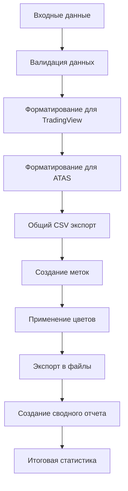

# Блок 15: Экспорт разметки

## Обзор

Блок экспорта разметки предназначен для выгрузки событий детекторов, результатов бэктеста и других данных в форматы, совместимые с популярными торговыми платформами: TradingView и ATAS. Он обеспечивает гибкое форматирование данных с настраиваемыми метками, цветами и структурой.

## Ключевые возможности

### 1. Многоплатформенный экспорт
- **TradingView**: Оптимизированный формат для анализа на TradingView
- **ATAS**: Специализированный формат с цветовой схемой для ATAS
- **Общий CSV**: Универсальный формат для дальнейшего анализа

### 2. Интеллектуальное форматирование
- **Автоматические метки**: Создание меток на основе типа паттерна и уверенности
- **Цветовая схема**: Настраиваемые цвета для разных типов паттернов
- **Временные форматы**: Адаптация под требования каждой платформы

### 3. Расширенная отчетность
- **Сводные отчеты**: Детальная статистика по экспортированным данным
- **Анализ паттернов**: Распределение по типам, уверенности, биржам
- **Временной анализ**: Диапазоны и продолжительность данных

### 4. Гибкая конфигурация
- **Настройки экспорта**: Кодировка, разделители, форматы чисел
- **Фильтрация данных**: По уверенности, паттернам, биржам
- **Производительность**: Чанковая обработка, параллелизм

## Архитектура

### Основные компоненты

```
ExportEngine
├── export_to_csv()           # Основной экспорт в CSV
├── format_for_tradingview()  # Форматирование для TradingView
├── format_for_atas()         # Форматирование для ATAS
├── _create_tv_marker()       # Создание меток TradingView
├── _create_atas_marker()     # Создание меток ATAS
├── _create_atas_color()      # Создание цветов ATAS
├── _create_export_summary()  # Создание сводного отчета
└── run_export()              # Основная функция экспорта
```

### Поток обработки



## Использование

### Базовое использование

```python
from oflow.blocks.export import run_export
from pathlib import Path
import yaml

# Загрузка конфигурации
with open('configs/export.yaml', 'r') as f:
    config = yaml.safe_load(f)

# Запуск экспорта
run_export(
    events_df=detector_events,
    config=config,
    output_dir=Path("data/export")
)
```

### Продвинутое использование

```python
from oflow.blocks.export import format_for_tradingview, format_for_atas

# Форматирование для TradingView
tv_df = format_for_tradingview(events_df, config)

# Форматирование для ATAS
atas_df = format_for_atas(events_df, config)

# Кастомный экспорт
export_to_csv(tv_df, Path("custom_tv.csv"), "tradingview", config)
```

## Конфигурация

### Основные настройки экспорта

```yaml
export:
  encoding: "utf-8"              # Кодировка файлов
  separator: ","                  # Разделитель полей
  decimal_separator: "."          # Разделитель десятичных чисел
  date_format: "%Y-%m-%d %H:%M:%S"  # Формат даты
  float_format: "%.6f"           # Формат чисел с плавающей точкой
```

### Настройки TradingView

```yaml
tradingview:
  enabled: true
  time_format: "%Y-%m-%d %H:%M:%S"
  columns:
    - "time"
    - "price"
    - "pattern"
    - "confidence_pct"
    - "strength"
    - "marker"
  
  markers:
    liquidity_vacuum_break: "LVB"
    iceberg_fade: "ICB"
    stop_run_continuation: "STP"
```

### Настройки ATAS

```yaml
atas:
  enabled: true
  date_format: "%m/%d/%Y"
  time_format: "%H:%M:%S"
  
  colors:
    liquidity_vacuum_break: "RED"
    iceberg_fade: "BLUE"
    stop_run_continuation: "GREEN"
```

## Структура данных

### Входные данные (events_df)

```python
events_df.columns = [
    'ts_ns',              # Временная метка (наносекунды)
    'exchange',           # Название биржи
    'symbol',             # Торговый символ
    'pattern_type',       # Тип паттерна
    'confidence',         # Уверенность (0.0-1.0)
    'volume_ratio',       # Соотношение объема
    'price_level',        # Ценовой уровень
    'detector_score'      # Оценка детектора
]
```

### Выходные данные

#### 1. TradingView (marks_tradingview.csv)
```python
tv_df.columns = [
    'Time',               # Время в формате TradingView
    'Price',              # Цена
    'Pattern',            # Тип паттерна
    'Confidence %',       # Уверенность в процентах
    'Strength',           # Сила сигнала (STRONG/MEDIUM/WEAK)
    'Volume Multiplier',  # Множитель объема
    'Marker',             # Метка (LVB_S, ICB_M, etc.)
    'Exchange',           # Биржа
    'Symbol'              # Символ
]
```

#### 2. ATAS (marks_atas.csv)
```python
atas_df.columns = [
    'Date',               # Дата в формате MM/DD/YYYY
    'Time',               # Время в формате HH:MM:SS
    'Price',              # Цена
    'Marker',             # Уникальная метка (LVB_HIGH, ICB_MED, etc.)
    'Color',              # Цвет (RED_BRIGHT, BLUE_NORMAL, etc.)
    'Pattern',            # Тип паттерна
    'Confidence',         # Уверенность
    'VolumeRatio',        # Соотношение объема
    'Exchange'            # Биржа
]
```

#### 3. Общий CSV (marks_general.csv)
```python
general_df.columns = [
    'ts_ns',              # Исходная временная метка
    'exchange',           # Биржа
    'symbol',             # Символ
    'pattern_type',       # Тип паттерна
    'confidence',         # Уверенность
    'volume_ratio',       # Соотношение объема
    'price_level',        # Ценовой уровень
    'detector_score'      # Оценка детектора
]
```

## Алгоритмы

### 1. Форматирование для TradingView

```python
def format_for_tradingview(events_df, config):
    # 1. Форматирование времени
    tv_df['time'] = pd.to_datetime(events_df['ts_ns'], unit='ns')
    
    # 2. Форматирование цены
    tv_df['price'] = events_df['price_level'].round(6)
    
    # 3. Создание меток
    tv_df['marker'] = events_df.apply(_create_tv_marker, axis=1)
    
    # 4. Выбор и переименование колонок
    return tv_df[selected_columns].rename(columns=column_mapping)
```

### 2. Форматирование для ATAS

```python
def format_for_atas(events_df, config):
    # 1. Форматирование времени для ATAS
    atas_df['DateTime'] = pd.to_datetime(events_df['ts_ns'], unit='ns')
    atas_df['Date'] = atas_df['DateTime'].dt.strftime('%m/%d/%Y')
    atas_df['Time'] = atas_df['DateTime'].dt.strftime('%H:%M:%S')
    
    # 2. Создание меток
    atas_df['Marker'] = events_df.apply(_create_atas_marker, axis=1)
    
    # 3. Создание цветов
    atas_df['Color'] = events_df.apply(_create_atas_color, axis=1)
    
    return atas_df
```

### 3. Создание меток

```python
def _create_tv_marker(row):
    pattern = row.get('pattern_type', '').upper()
    confidence = row.get('confidence', 0.0)
    
    # Базовые метки по типу паттерна
    if 'liquidity_vacuum_break' in pattern:
        base_marker = 'LVB'
    elif 'iceberg_fade' in pattern:
        base_marker = 'ICB'
    # ... другие паттерны
    
    # Уровень уверенности
    if confidence >= 0.8:
        strength = 'S'  # Strong
    elif confidence >= 0.6:
        strength = 'M'  # Medium
    else:
        strength = 'W'  # Weak
    
    return f"{base_marker}_{strength}"
```

### 4. Создание цветов для ATAS

```python
def _create_atas_color(row):
    pattern = row.get('pattern_type', '')
    confidence = row.get('confidence', 0.0)
    
    # Цвета по типу паттерна
    if 'liquidity_vacuum_break' in pattern:
        base_color = 'RED'
    elif 'iceberg_fade' in pattern:
        base_color = 'BLUE'
    # ... другие паттерны
    
    # Интенсивность по уверенности
    if confidence >= 0.8:
        intensity = 'BRIGHT'
    elif confidence >= 0.6:
        intensity = 'NORMAL'
    else:
        intensity = 'DIM'
    
    return f"{base_color}_{intensity}"
```

## Метки и цветовая схема

### TradingView метки

| Паттерн | Уверенность | Метка | Описание |
|----------|-------------|-------|----------|
| Scalping Strategy | ≥0.8 | LVB_S | Сильный сигнал вакуума ликвидности |
| Scalping Strategy | 0.6-0.8 | LVB_M | Средний сигнал вакуума ликвидности |
| Scalping Strategy | <0.6 | LVB_W | Слабый сигнал вакуума ликвидности |
| Iceberg Fade | ≥0.8 | ICB_S | Сильный сигнал тающего айсберга |
| Stop Run Continuation | ≥0.8 | STP_S | Сильный сигнал продолжения стопов |
| Momentum Ignition | ≥0.8 | MOM_S | Сильный сигнал разгона импульса |

### ATAS метки и цвета

| Паттерн | Уверенность | Метка | Цвет | Описание |
|----------|-------------|-------|------|----------|
| Scalping Strategy | ≥0.8 | LVB_HIGH | RED_BRIGHT | Яркий красный - вакуум ликвидности |
| Scalping Strategy | 0.6-0.8 | LVB_MED | RED_NORMAL | Обычный красный - вакуум ликвидности |
| Iceberg Fade | ≥0.8 | ICB_HIGH | BLUE_BRIGHT | Яркий синий - тающий айсберг |
| Stop Run Continuation | ≥0.8 | STP_HIGH | GREEN_BRIGHT | Яркий зеленый - продолжение стопов |
| Momentum Ignition | ≥0.8 | MOM_HIGH | YELLOW_BRIGHT | Яркий желтый - разгон импульса |

## Отчетность

### Сводный отчет (export_summary.txt)

```
=== СВОДНЫЙ ОТЧЕТ ПО ЭКСПОРТУ ===

Дата экспорта: 2024-01-15 10:30:00
Всего событий: 1250

=== РАСПРЕДЕЛЕНИЕ ПО ПАТТЕРНАМ ===
liquidity_vacuum_break: 450 (36.0%)
iceberg_fade: 320 (25.6%)
stop_run_continuation: 280 (22.4%)
momentum_ignition: 200 (16.0%)

=== СТАТИСТИКА УВЕРЕННОСТИ ===
Средняя уверенность: 0.723
Высокая уверенность (≥0.8): 500 (40.0%)
Средняя уверенность (0.6-0.8): 450 (36.0%)
Низкая уверенность (<0.6): 300 (24.0%)

=== ЭКСПОРТИРОВАННЫЕ ФАЙЛЫ ===
marks_tradingview.csv - Данные для TradingView
marks_atas.csv - Данные для ATAS
marks_general.csv - Общий CSV экспорт
export_summary.txt - Этот отчет
```

## Интеграция с другими блоками

### Входные данные

- **Блок 12**: Детекторы - события паттернов для экспорта
- **Блок 14**: Бэктест - результаты торговли для экспорта
- **Блок 10**: Фичи паттернов - признаки для анализа

### Выходные данные

- **TradingView**: Готовые файлы для импорта в TradingView
- **ATAS**: Специализированные файлы для ATAS
- **Анализ**: Общие CSV файлы для дальнейшего анализа

## Примеры использования

### Пример 1: Экспорт только для TradingView

```yaml
tradingview:
  enabled: true
  
atas:
  enabled: false

general:
  enabled: false
```

### Пример 2: Кастомные метки

```yaml
tradingview:
  markers:
    liquidity_vacuum_break: "VACUUM"
    iceberg_fade: "ICEBERG"
    stop_run_continuation: "STOPRUN"
```

### Пример 3: Фильтрация по уверенности

```yaml
tradingview:
  filters:
    min_confidence: 0.8  # Только высокоуверенные сигналы

atas:
  filters:
    min_confidence: 0.7  # Средняя и высокая уверенность
```

## Troubleshooting

### Типичные проблемы

1. **Пустые файлы**: Проверить входные данные и фильтры
2. **Неправильные метки**: Проверить настройки меток в конфигурации
3. **Ошибки кодировки**: Проверить настройки encoding
4. **Медленная работа**: Оптимизировать размер чанка, включить параллелизм

### Отладка

```python
# Включить детальное логирование
import logging
logging.basicConfig(level=logging.DEBUG)

# Проверить промежуточные результаты
tv_df = format_for_tradingview(events_df, config)
print(f"TradingView колонки: {tv_df.columns}")
print(f"Пример меток: {tv_df['Marker'].head()}")
```

## Будущие улучшения

1. **Дополнительные платформы**: MetaTrader, NinjaTrader, Sierra Charts
2. **Графические экспорты**: PNG, SVG с аннотациями
3. **Real-time экспорт**: Потоковая передача данных
4. **API интеграция**: Прямая отправка в торговые платформы
5. **Автоматическая синхронизация**: Обновление данных в реальном времени
6. **Кастомные форматы**: Пользовательские шаблоны экспорта
