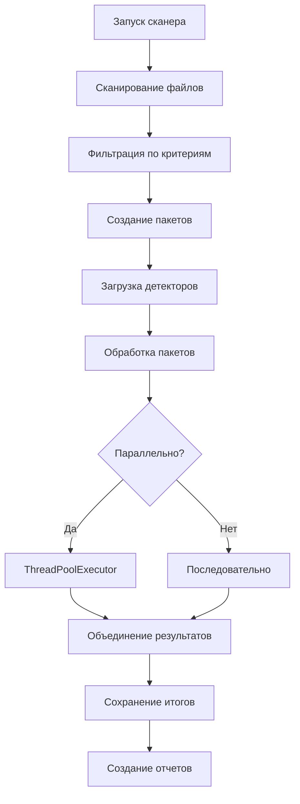

# Блок 13: Сканер данных

## Обзор

Сканер данных предназначен для автоматического поиска, обработки и анализа больших объемов исторических данных с помощью детекторов паттернов. Это мощный инструмент для массового анализа торговых данных с возможностью параллельной обработки и гибкой фильтрации.

## Ключевые возможности

### 1. Автоматическое сканирование
- Поиск файлов в канонических директориях
- Использование индексов файлов для быстрого доступа
- Рекурсивный поиск в поддиректориях
- Фильтрация по датам, биржам и символам

### 2. Пакетная обработка
- Разбиение больших объемов на управляемые пакеты
- Параллельная и последовательная обработка
- Контроль использования памяти
- Обработка ошибок и восстановление

### 3. Интеграция с детекторами
- Автоматический запуск всех настроенных детекторов
- Валидация входных данных для детекторов
- Объединение и сохранение результатов
- Создание итоговых отчетов

### 4. Мониторинг и отчетность
- Детальное прогресс-логирование
- Отчеты о производительности
- Статистика по найденным событиям
- Логирование ошибок и предупреждений

## Архитектура

### Основные компоненты

```
DataScanner
├── scan_canonical_files()     # Поиск и фильтрация файлов
├── create_batches()           # Создание пакетов для обработки
├── load_batch_data()          # Загрузка данных пакета
├── process_batch()            # Обработка одного пакета
└── run_full_scan()            # Полное сканирование и детекция
```

### Поток обработки



## Использование

### Базовое использование

```python
from oflow.blocks.scanner import run_scanner
from pathlib import Path
import yaml

# Загрузка конфигураций
with open('configs/scanner.yaml', 'r') as f:
    scanner_config = yaml.safe_load(f)

with open('configs/detectors.yaml', 'r') as f:
    detectors_config = yaml.safe_load(f)

# Запуск сканирования
results = run_scanner(
    config=scanner_config,
    detectors_config=detectors_config,
    data_dir=Path("data/canon"),
    output_dir=Path("data/events")
)

# Анализ результатов
for detector_name, events_df in results.items():
    if not events_df.empty:
        print(f"{detector_name}: найдено {len(events_df)} событий")
```

### Продвинутое использование

```python
from oflow.blocks.scanner import DataScanner
from oflow.blocks.detectors import create_detectors_from_config

# Создание сканера с кастомной конфигурацией
config = {
    'processing': {
        'batch_size': 5,
        'max_workers': 2
    },
    'filters': {
        'date_range': {
            'start': '20241201',
            'end': '20241207'
        },
        'exchanges': ['binance', 'bybit']
    }
}

scanner = DataScanner(config)

# Поэтапное выполнение
data_dir = Path("data/canon")
output_dir = Path("data/events")

# 1. Сканирование файлов
found_files = scanner.scan_canonical_files(data_dir)
print(f"Найдено файлов: {sum(len(files) for files in found_files.values())}")

# 2. Создание пакетов
batches = scanner.create_batches(found_files)
print(f"Создано пакетов: {len(batches)}")

# 3. Полное сканирование
results = scanner.run_full_scan(data_dir, output_dir, detectors_config)
```

## Конфигурация

### Основные параметры

```yaml
# Обработка
processing:
  batch_size: 10                    # Файлов в пакете
  max_workers: 4                    # Параллельных воркеров
  memory_limit_gb: 8                # Лимит памяти

# Фильтры
filters:
  date_range:
    start: "20241201"               # Начальная дата
    end: "20241231"                 # Конечная дата
  exchanges: ["binance", "bybit"]   # Только эти биржи
  symbols: ["ETHUSDT"]              # Только этот символ
```

### Режимы работы

```yaml
modes:
  development:
    enabled: true
    limit_files_per_type: 10        # Ограничить для тестов
  
  production:
    enabled: false
    optimize_for_speed: true        # Максимальная производительность
```

## Фильтрация данных

### Фильтр по датам

Поддерживает фильтрацию по диапазону дат:

```yaml
filters:
  date_range:
    start: "20241201"    # Начальная дата (включительно)
    end: "20241231"      # Конечная дата (включительно)
```

Формат даты: `YYYYMMDD`. Оба параметра опциональны.

### Фильтр по биржам

```yaml
filters:
  exchanges: ["binance", "bybit", "okx"]
```

Ищет соответствие в пути к файлу (регистронезависимо).

### Фильтр по символам

```yaml
filters:
  symbols: ["ETHUSDT", "BTCUSDT"]
```

Ищет соответствие в пути к файлу (регистронезависимо).

## Пакетная обработка

### Создание пакетов

Сканер автоматически создает пакеты файлов для эффективной обработки:

```python
# Пример структуры пакета
batch = {
    'quotes': [Path('quotes_20241201_20241201.parquet')],
    'book_top': [Path('book_top_20241201_20241201.parquet')],
    'tape': [Path('tape_20241201_20241201.parquet')],
    'features': []  # Может быть пустым
}
```

### Параллельная обработка

При `max_workers > 1` используется параллельная обработка:

```python
# Настройка параллельности
config = {
    'processing': {
        'max_workers': 4,           # 4 параллельных воркера
        'batch_size': 8             # 8 файлов на пакет
    }
}
```

## Алгоритмы

### 1. Сканирование файлов

```python
def scan_canonical_files(self, data_dir: Path) -> Dict[str, List[Path]]:
    # 1. Загрузка индекса файлов (если есть)
    # 2. Поиск файлов по типам данных
    # 3. Применение фильтров
    # 4. Возврат структурированного списка
```

### 2. Фильтрация

```python
def _passes_filters(self, file_info: Dict, file_path: Path) -> bool:
    # Проверка по дате
    if not self._check_date_filter(file_info, file_path):
        return False
    
    # Проверка по биржам
    if not self._check_exchange_filter(file_path):
        return False
    
    # Проверка по символам
    if not self._check_symbol_filter(file_path):
        return False
    
    return True
```

### 3. Пакетная обработка

```python
def process_batch(self, batch: Dict[str, List[Path]], detectors: List, 
                 output_dir: Path, batch_num: int) -> Dict[str, pd.DataFrame]:
    # 1. Загрузка данных пакета
    batch_data = self.load_batch_data(batch)
    
    # 2. Валидация для детекторов
    if not self._validate_for_detectors(batch_data):
        return {}
    
    # 3. Запуск детекторов
    results = run_detectors(detectors, batch_data, output_dir)
    
    return results
```

## Структура вывода

### Организация файлов

```
data/events/
├── batch_001/                      # Результаты первого пакета
│   ├── events_d1liquidityvacuumbreak.parquet
│   ├── events_d2absorptionflip.parquet
│   └── ...
├── batch_002/                      # Результаты второго пакета
├── summary/                        # Финальные результаты
│   ├── final_d1liquidityvacuumbreak.parquet
│   ├── final_d2absorptionflip.parquet
│   ├── scan_report.json
│   └── ...
```

### Отчет сканирования

```json
{
  "scan_completed_at": "2024-12-01T12:00:00",
  "total_detectors": 8,
  "detectors_with_events": 3,
  "total_events": 1247,
  "detector_summary": {
    "D1LiquidityVacuumBreak": {
      "event_count": 45,
      "has_events": true
    },
    "D2AbsorptionFlip": {
      "event_count": 0,
      "has_events": false
    }
  }
}
```

## Производительность

### Оптимизации

1. **Использование индексов файлов**: Быстрый поиск через `file_index.json`
2. **Пакетная обработка**: Эффективное использование памяти
3. **Параллелизм**: Многопоточная обработка пакетов
4. **Кеширование метаданных**: Избежание повторного чтения

### Рекомендации по настройке

```yaml
# Для больших объемов данных
processing:
  batch_size: 5                     # Меньше файлов на пакет
  max_workers: 8                    # Больше воркеров
  memory_limit_gb: 16               # Больше памяти

# Для быстрой обработки
processing:
  batch_size: 20                    # Больше файлов на пакет
  max_workers: 4                    # Умеренное количество воркеров
```

### Мониторинг производительности

```python
# Пример отслеживания прогресса
scanner = DataScanner(config)
results = scanner.run_full_scan(data_dir, output_dir, detectors_config)

# Логи покажут:
# ⏱️  Время выполнения: 245.67с
# 📁 Обработано пакетов: 12
# 🔍 Успешных детекторов: 6/8
# 🎯 Всего событий найдено: 1247
```

## Интеграция с другими блоками

### Входные данные

Сканер работает с каноническими данными из Блока 11:

```
data/canon/
├── quotes/
├── book_top/
├── tape/
├── nbbo/
├── basis/
└── features/
```

### Использование результатов

```python
# Результаты сканирования можно использовать в блоке 14 (Бэктест)
scan_results = run_scanner(scanner_config, detectors_config)

# Загрузка событий для бэктеста
events_for_backtest = {}
for detector_name, events_df in scan_results.items():
    if not events_df.empty:
        events_for_backtest[detector_name] = events_df

# Передача в бэктест
from oflow.blocks.backtest import run_backtest
backtest_results = run_backtest(events_for_backtest, backtest_config)
```

## Логирование

### Уровни логирования

```
INFO:  Основные этапы и статистика
DEBUG: Детальная информация о файлах и пакетах
WARN:  Предупреждения о проблемах с данными
ERROR: Ошибки обработки
```

### Примеры логов

```
INFO: 🚀 Запуск полного сканирования и детекции
INFO: Этап 1/4: Сканирование канонических файлов...
INFO: ✓ Загружен индекс файлов
INFO: Найдено файлов по типам:
INFO:   - quotes: 30 файлов
INFO:   - book_top: 30 файлов
INFO:   - tape: 30 файлов
INFO: === Сканирование завершено за 2.45с ===

INFO: Этап 2/4: Создание детекторов...
INFO: Создано 8 детекторов

INFO: Этап 3/4: Создание пакетов данных...
INFO: Создано 12 пакетов для обработки

INFO: Этап 4/4: Обработка пакетов...
INFO: Параллельная обработка 12 пакетов (4 воркера)...
INFO: ✓ Пакет 1 завершен
INFO: ✓ Пакет 2 завершен
...

INFO: 📊 ИТОГОВАЯ СТАТИСТИКА СКАНИРОВАНИЯ:
INFO: ⏱️  Время выполнения: 245.67с
INFO: 📁 Обработано пакетов: 12
INFO: 🔍 Успешных детекторов: 6/8
INFO: 🎯 Всего событий найдено: 1247
INFO:   - D1LiquidityVacuumBreak: 45 событий
INFO:   - D4StopRunContinuation: 28 событий
INFO:   - D8MomentumIgnition: 1174 события
INFO: 🎉 Полное сканирование завершено!
```

## Обработка ошибок

### Стратегии восстановления

```yaml
error_handling:
  continue_on_file_error: true      # Продолжать при ошибке файла
  continue_on_batch_error: true     # Продолжать при ошибке пакета
  continue_on_detector_error: true  # Продолжать при ошибке детектора
  max_consecutive_errors: 5         # Максимум ошибок подряд
```

### Типичные ошибки и решения

1. **Поврежденный файл**
   ```
   WARNING: Ошибка чтения /path/to/file.parquet: File corrupted
   ```
   **Решение**: Файл пропускается, обработка продолжается

2. **Недостаточно памяти**
   ```
   ERROR: Пакет 5: недостаточно памяти для загрузки
   ```
   **Решение**: Уменьшить `batch_size` в конфигурации

3. **Отсутствуют обязательные данные**
   ```
   WARNING: Пакет 3: отсутствуют данные ['book_top'], пропускаем детекцию
   ```
   **Решение**: Проверить наличие всех типов данных

## Troubleshooting

### Производительность

**Проблема**: Медленная обработка
```yaml
# Решение: Оптимизация конфигурации
processing:
  max_workers: 8        # Увеличить количество воркеров
  batch_size: 5         # Уменьшить размер пакета
  
performance:
  optimize_memory_usage: true
  cleanup_temp_data: true
```

**Проблема**: Высокое потребление памяти
```yaml
# Решение: Ограничение ресурсов
processing:
  memory_limit_gb: 4
  batch_size: 3
  max_workers: 2
```

### Данные

**Проблема**: Не находит файлы
```yaml
# Проверить фильтры
filters:
  date_range:
    start: null         # Убрать ограничения
    end: null
  exchanges: []         # Убрать фильтры
  symbols: []
```

**Проблема**: Не находит события
- Проверить конфигурацию детекторов
- Убедиться в корректности входных данных
- Проанализировать параметры детекторов

### Отладка

```python
# Включить детальное логирование
import logging
logging.basicConfig(level=logging.DEBUG)

# Использовать режим разработки
config['modes']['development']['enabled'] = True
config['modes']['development']['limit_files_per_type'] = 5
```

## Примеры использования

### Пример 1: Поиск событий за неделю

```python
config = {
    'processing': {'batch_size': 10, 'max_workers': 4},
    'filters': {
        'date_range': {'start': '20241201', 'end': '20241207'},
        'exchanges': ['binance']
    }
}

results = run_scanner(config, detectors_config)
```

### Пример 2: Анализ конкретной биржи

```python
config = {
    'filters': {'exchanges': ['bybit']},
    'processing': {'max_workers': 2}
}

results = run_scanner(config, detectors_config)
```

### Пример 3: Быстрое тестирование

```python
config = {
    'modes': {
        'development': {
            'enabled': True,
            'limit_files_per_type': 5
        }
    },
    'processing': {'batch_size': 2}
}

results = run_scanner(config, detectors_config)
```

## Будущие улучшения

1. **Распределенная обработка**: Поддержка Dask/Ray для кластерной обработки
2. **Инкрементальное сканирование**: Обработка только новых файлов
3. **Умное кеширование**: Кеширование результатов детекторов
4. **Real-time мониторинг**: Веб-интерфейс для отслеживания прогресса
5. **Машинное обучение**: Автоматическая настройка параметров детекторов
