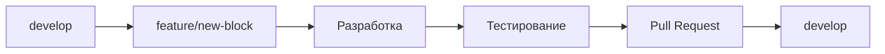
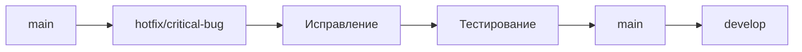

# 🌿 **СТРАТЕГИЯ ВЕТВЛЕНИЯ GIT - SCALPING STRATEGY**

## 📋 **ОБЗОР**

Упрощенная стратегия ветвления для проекта Scalping Strategy, основанная на принципах GitFlow, но с минимальным набором веток для быстрой разработки и простого управления.

## 🎯 **ЦЕЛИ**

- **Простота**: Минимальное количество веток
- **Скорость**: Быстрая разработка и деплой
- **Надежность**: Стабильный продакшн код
- **Понятность**: Прозрачная логика для всей команды

## 🌳 **СТРУКТУРА ВЕТОК**

### **ОСНОВНЫЕ ВЕТКИ**

#### **`main`** (было `master`)
- **Назначение**: Продакшн код, стабильные релизы
- **Защита**: Только через Pull Request
- **Источник**: Ветка `develop` или `hotfix/*`
- **Автоматизация**: Автоматический деплой в продакшн

#### **`develop`**
- **Назначение**: Интеграционная ветка для разработки
- **Защита**: Только через Pull Request
- **Источник**: Ветки `feature/*`
- **Автоматизация**: Автоматические тесты, сборка

### **ВЕТКИ РАЗРАБОТКИ**

#### **`feature/*`**
- **Назначение**: Разработка новых функций, блоков, улучшений
- **Источник**: Ветка `develop`
- **Назначение**: Мерж в `develop`
- **Правила именования**: `feature/тип-описание`

#### **`hotfix/*`**
- **Назначение**: Срочные исправления критических багов в продакшне
- **Источник**: Ветка `main`
- **Назначение**: Мерж в `main` + `develop`
- **Правила именования**: `hotfix/описание-проблемы`

## 📝 **ПРАВИЛА ИМЕНОВАНИЯ**

### **Feature ветки**
```
feature/block-16-ml-predictions      # Новый блок
feature/enhancement-detectors        # Улучшение детекторов
feature/config-optimization          # Оптимизация конфигурации
feature/docs-api-reference           # Документация API
feature/bugfix-memory-leak          # Исправление бага
feature/performance-improvement      # Улучшение производительности
```

### **Hotfix ветки**
```
hotfix/critical-memory-leak         # Критическая утечка памяти
hotfix/security-vulnerability       # Уязвимость безопасности
hotfix/data-corruption              # Повреждение данных
hotfix/api-timeout                  # Таймаут API
```

## 🔄 **ЖИЗНЕННЫЙ ЦИКЛ ВЕТОК**

### **1. Feature разработка**


### **2. Hotfix процесс**


## 📋 **ПРАВИЛА РАБОТЫ**

### **Общие принципы**
1. **Всегда работаем от актуальной ветки**
2. **Коммиты должны быть атомарными**
3. **Сообщения коммитов на русском языке**
4. **Тестируем перед мержем**

### **Feature ветки**
1. **Создание**: `git checkout -b feature/название develop`
2. **Разработка**: Регулярные коммиты с понятными сообщениями
3. **Синхронизация**: `git rebase develop` перед мержем
4. **Мерж**: Pull Request в `develop`

### **Hotfix ветки**
1. **Создание**: `git checkout -b hotfix/описание main`
2. **Исправление**: Минимальные изменения для решения проблемы
3. **Тестирование**: Обязательное тестирование на staging
4. **Мерж**: Сначала в `main`, затем в `develop`

## 🚀 **ПРОЦЕСС РЕЛИЗА**

### **Подготовка релиза**
1. **Создание релизной ветки**: `git checkout -b release/v1.2.0 develop`
2. **Финальное тестирование**: Все тесты должны проходить
3. **Обновление версий**: В `__version__` и документации
4. **Мерж в main**: `git checkout main && git merge release/v1.2.0`
5. **Тег версии**: `git tag -a v1.2.0 -m "Релиз v1.2.0"`
6. **Мерж в develop**: `git checkout develop && git merge release/v1.2.0`
7. **Удаление релизной ветки**: `git branch -d release/v1.2.0`

### **Автоматизация**
- **Автоматические тесты** при каждом коммите
- **Автоматическая сборка** при мерже в `develop`
- **Автоматический деплой** при мерже в `main`
- **Автоматическое создание релизов** при тегах

## 🛠 **ИНСТРУМЕНТЫ И НАСТРОЙКИ**

### **Git Hooks**
```bash
# pre-commit: Проверка кода
pre-commit install

# pre-push: Запуск тестов
# commit-msg: Проверка сообщения коммита
```

### **Git Aliases**
```bash
# Создание feature ветки
git config --global alias.feature '!git checkout -b feature/$1 develop'

# Создание hotfix ветки
git config --global alias.hotfix '!git checkout -b hotfix/$1 main'

# Синхронизация с develop
git config --global alias.sync '!git fetch origin && git rebase origin/develop'
```

### **Git Flow команды**
```bash
# Инициализация Git Flow
git flow init -d

# Создание feature
git flow feature start название

# Завершение feature
git flow feature finish название

# Создание hotfix
git flow hotfix start название

# Завершение hotfix
git flow hotfix finish название
```

## 📊 **МЕТРИКИ И МОНИТОРИНГ**

### **Ключевые показатели**
- **Время от коммита до деплоя**
- **Количество конфликтов при мерже**
- **Время решения hotfix**
- **Качество кода** (coverage, linting)

### **Отчеты**
- **Еженедельный обзор веток**
- **Анализ конфликтов**
- **Статистика релизов**
- **Производительность команды**

## 🚨 **ЧРЕЗВЫЧАЙНЫЕ СИТУАЦИИ**

### **Критический баг в продакшне**
1. **Немедленное создание hotfix** от `main`
2. **Быстрое исправление** с минимальными изменениями
3. **Экстренное тестирование** на staging
4. **Срочный мерж** в `main` и деплой
5. **Последующий мерж** в `develop`

### **Откат релиза**
1. **Создание hotfix** для отката
2. **Откат к предыдущей версии** в `main`
3. **Обновление документации**
4. **Анализ причин** проблемы

## 📚 **ЛУЧШИЕ ПРАКТИКИ**

### **Коммиты**
- **Один коммит = одно изменение**
- **Понятные сообщения на русском языке**
- **Использование conventional commits**
- **Регулярные коммиты** (не реже раза в день)

### **Ветки**
- **Короткоживущие feature ветки** (не более 2 недель)
- **Регулярная синхронизация** с `develop`
- **Быстрое решение конфликтов**
- **Удаление мерженных веток**

### **Тестирование**
- **Автоматические тесты** для всего кода
- **Code review** для всех изменений
- **Тестирование на staging** перед продакшном
- **Мониторинг** после деплоя

## 🔮 **БУДУЩИЕ УЛУЧШЕНИЯ**

### **Краткосрочные (1-3 месяца)**
- **Автоматизация релизов** через GitHub Actions
- **Интеграция с Jira** для отслеживания задач
- **Автоматическое создание changelog**
- **Уведомления** о статусе деплоя

### **Долгосрочные (3-12 месяцев)**
- **AI-ассистент** для анализа конфликтов
- **Предсказание** проблем с мержем
- **Автоматическая оптимизация** процесса
- **Интеграция с CI/CD** пайплайнами

## 📞 **ПОДДЕРЖКА И КОНСУЛЬТАЦИИ**

### **Внутренние ресурсы**
- **Документация**: Этот файл + README
- **Команда**: Опытные разработчики
- **Процессы**: Стандартные операционные процедуры

### **Внешние ресурсы**
- **Git Flow**: https://nvie.com/posts/a-successful-git-branching-model/
- **GitHub Flow**: https://guides.github.com/introduction/flow/
- **Conventional Commits**: https://www.conventionalcommits.org/

---

**Версия документации**: 1.0.0  
**Последнее обновление**: Август 2025  
**Автор**: Команда Scalping Strategy  
**Статус**: ✅ Активна
